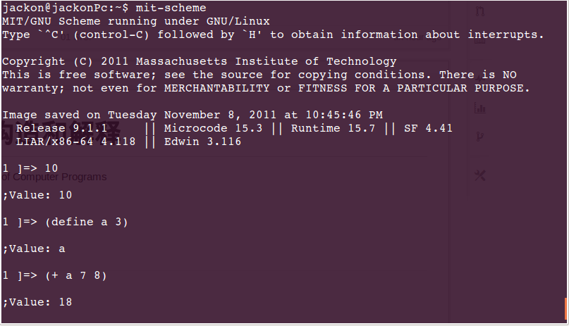

计算机程序的构造和解释
=================================================

- 英文名: Structure and Interpretation of Computer Programs
- douban: [http://book.douban.com/subject/1148282/][SICP]

[SICP]: http://book.douban.com/subject/1148282/

阅读动机
--------

1. 自从接触了 JAVAScript, 尤其是听了 Douglas Crockford 的[三部视频](http://www.misspy.com/blog/2013/05/25/javascript-primer/)之后，对函数式编程有了最初的了解和兴趣。
2. python 的修饰器用的多了，多函数式编程的需求越来越强烈。
3. 各种理解不透 python 的 map-reduce, 不能忍了。

scheme 环境搭建
---------------

[download page](http://www.gnu.org/software/mit-scheme/)

下载之后根据 instruction 安装即可。

运行

```
$ mit-scheme
```


